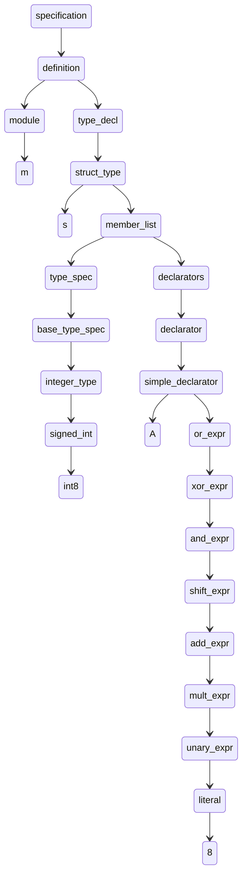
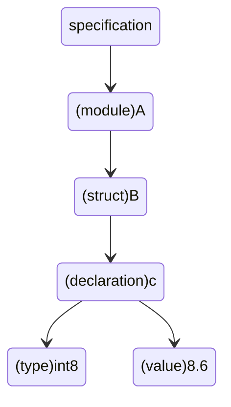

### 1.关于这个程序的使用

在src\main\java\org\midl目录下有两个文件夹


其中一个名为MIDL，是存放源代码的目录，将后缀名为.idl的文件放入后，启动程序，会将目标代码输出到HXX文件下的对应.hxx文件中

### 2.实验一

我设计的AST存放在项目根目录下的asset中

编译程序会将每个MIDL的源码对应的AST一同输出到目标代码中，并用注释隐藏。例如对MIDL目录下的text5进行处理，其源码如下：

```
module m{
    struct s{
        int8 A=8;
    };
};
```

这是其抽象语法树(这里应该是有图的,没有的话联系一下我)




编译器会为每个参与编译的代码生成抽象语法树，并以xxxAST.md命名，同目标代码放到HXX文件夹下。

但是因为这个编译器还不够完美，面对很复杂的源码时，这个抽象语法树就会变得非常抽象。因此我根据符号表，又设计一个结构清晰的应该不能成为抽象语法数的东西，供参考

这个命名为xxxSimple.md也放在HXX文件夹下




### 2.实验二

#### 类型检查，命名检查

这一例子可使用MIDL下的text4

其源码如下：

```
struct A{
    short a='a';
};
struct A{
    short a=100000;
};
struct A{
    short a=15.24;
};
struct A{
    short a[4]=[10,12,45.34,'a'];
};
```

面对有错误的代码，编译器不给予编译，并在控制台输出错误信息

```
正在检查text4.idl中是否有错误
::A::a存在类型错误,short不可赋值为'a'
::A::a存在溢出错误,short不可赋值为100000
::A::a存在类型错误,short不可赋值为15.24
::A::a存在类型错误,short[]不可赋值为[10, 12, 45.34, 'a']

::A 命名重复
```

另外，对于没有定义module情况，这里使用空白命来为其命名


在text3中使用了另一例子

```
module space1{
    struct B{
        short a;
    };
};
module space2{
    struct A{
        space1::B b;
        space1::C b;
    };
};
```

在这种情况下，编译成徐会识别space1::B，但不会识别space1::C，其错误信息如下：

```
space1::C 未被定义space2::A::b 命名重复
```

总共两个错误信息，一个是无定义，一个是重复命名，编译器可一次同时识别多个错误并返回

#### 代码输出

使用StringTemplate来进行代码输出，因为对c++不熟悉，可能有些地方有点缺陷，望海涵。

这个StringTemplate用起来的感觉像个MVC模式下的jsp，后端绑定数据，前端展示数据。

其他详细看看HXX目录下的代码输出即可。

### 3.编译器设计历程

​        这个antlr4可以完成编译器设计中的词法分析，语法分析，功能还是很强的，不过有一些坑踩了才知道麻烦，在定义g4时，一开始没有学会使用fragment关键字，导致分析屡屡碰壁，总是不能识别一些关键字符。还有就是ID定义一定要放在最后，一开始boolean总是被识别成ID才知道有问题。

​		在语法分析中，不断尝试了很多办法，最后用散列链表来处理符号表与冲突，本来想有错就抛就不用这么麻烦，但是这么做，一次性处理所有冲突和错误，想必用户体验能好点。具体设计了三个类：module，struct，declaration，struct中有HashMap<String，ArrayList<Declaration>>,module中有HashMap<String，ArrayList<struct>>,通过hashmap套arraylist来实现散列链表结构，这样的好处就是能重复处理冲突。以及实现几个类的正确相关联。

​		在目标代码输出的环节，主要就是对StringTemplate的使用，包括对类的输出，循环的输出，这两个足以应对大多数情况