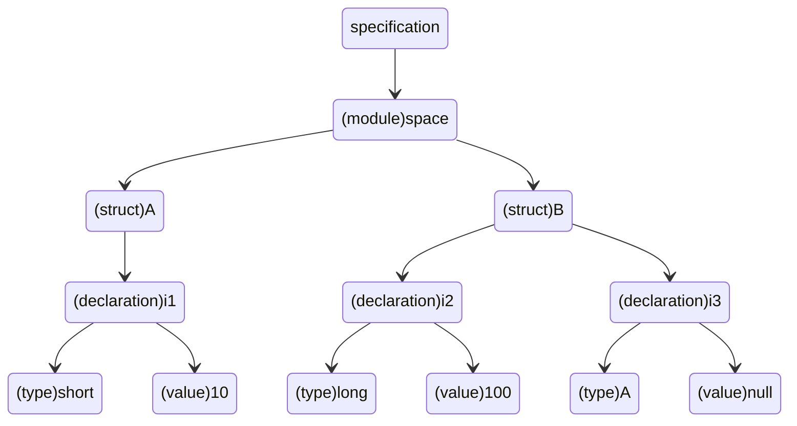

```mermaid
stateDiagram
specification --> (module)space
(module)space-->(struct)A
(struct)A-->(declaration)i1
(declaration)i1-->(type)short
(declaration)i1-->(value)10
(module)space-->(struct)B
(struct)B-->(declaration)i2
(declaration)i2-->(type)long
(declaration)i2-->(value)100
(struct)B-->(declaration)i3
(declaration)i3-->(type)A
(declaration)i3-->(value)null

```