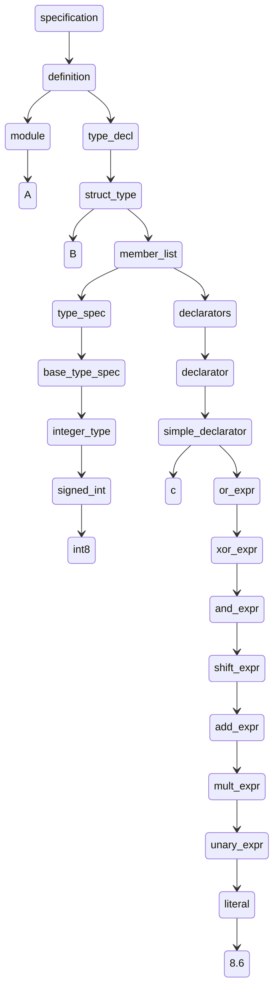

```mermaid
stateDiagram
specification --> definition
 definition --> module
  module -->A definition
 definition --> type_decl
  type_decl --> struct_type
    struct_type --> B
    struct_type --> member_list
     member_list --> type_spec
     member_list --> declarators
      type_spec --> base_type_spec
       base_type_spec -->  integer_type
        integer_type --> signed_int
         signed_int -->int8
      declarators --> declarator
       declarator --> simple_declarator
        simple_declarator --> c
        simple_declarator --> or_expr
          or_expr --> xor_expr 
           xor_expr --> and_expr 
            and_expr --> shift_expr 
             shift_expr --> add_expr 
              add_expr --> mult_expr 
               mult_expr --> unary_expr 
                unary_expr --> literal
                 literal --> 8.6

```