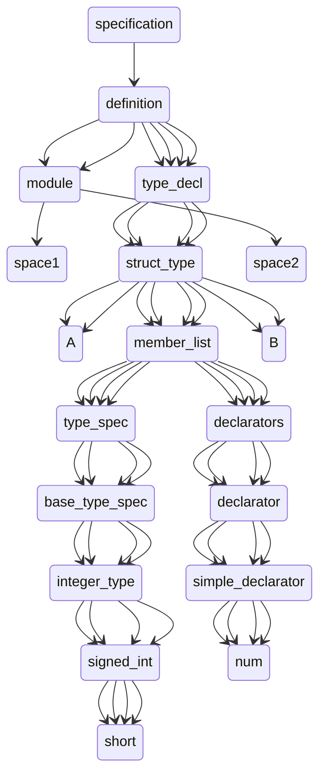

```mermaid
stateDiagram
specification --> definition definition
 definition --> module
  module -->space1 definition definition
 definition --> type_decl
  type_decl --> struct_type
    struct_type --> A
    struct_type --> member_list
     member_list --> type_spec
     member_list --> declarators
      type_spec --> base_type_spec
       base_type_spec -->  integer_type
        integer_type --> signed_int
         signed_int -->short
      declarators --> declarator
       declarator --> simple_declarator
        simple_declarator --> num
 definition --> type_decl
  type_decl --> struct_type
    struct_type --> B
    struct_type --> member_list
     member_list --> type_spec
     member_list --> declarators
      type_spec --> base_type_spec
       base_type_spec -->  integer_type
        integer_type --> signed_int
         signed_int -->short
      declarators --> declarator
       declarator --> simple_declarator
        simple_declarator --> num
 definition --> module
  module -->space2 definition definition
 definition --> type_decl
  type_decl --> struct_type
    struct_type --> A
    struct_type --> member_list
     member_list --> type_spec
     member_list --> declarators
      type_spec --> base_type_spec
       base_type_spec -->  integer_type
        integer_type --> signed_int
         signed_int -->short
      declarators --> declarator
       declarator --> simple_declarator
        simple_declarator --> num
 definition --> type_decl
  type_decl --> struct_type
    struct_type --> B
    struct_type --> member_list
     member_list --> type_spec
     member_list --> declarators
      type_spec --> base_type_spec
       base_type_spec -->  integer_type
        integer_type --> signed_int
         signed_int -->short
      declarators --> declarator
       declarator --> simple_declarator
        simple_declarator --> num

```