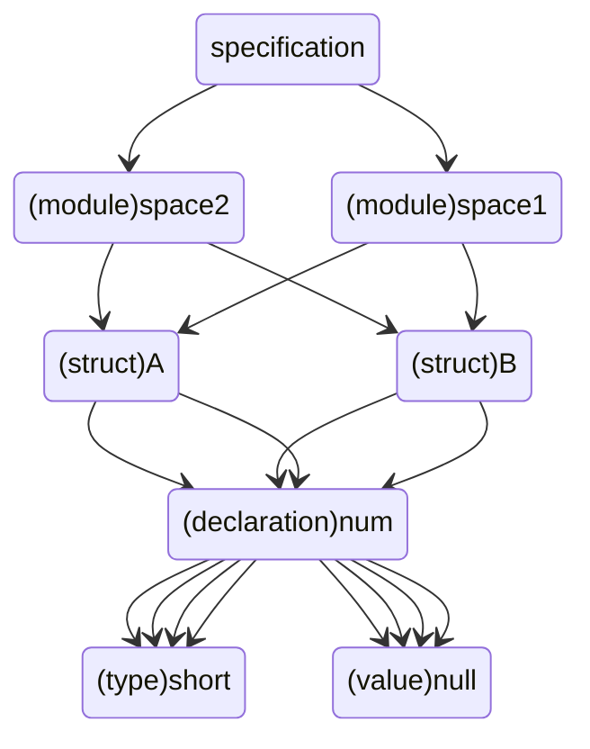

```mermaid
stateDiagram
specification --> (module)space2
(module)space2-->(struct)A
(struct)A-->(declaration)num
(declaration)num-->(type)short
(declaration)num-->(value)null
(module)space2-->(struct)B
(struct)B-->(declaration)num
(declaration)num-->(type)short
(declaration)num-->(value)null
specification --> (module)space1
(module)space1-->(struct)A
(struct)A-->(declaration)num
(declaration)num-->(type)short
(declaration)num-->(value)null
(module)space1-->(struct)B
(struct)B-->(declaration)num
(declaration)num-->(type)short
(declaration)num-->(value)null

```