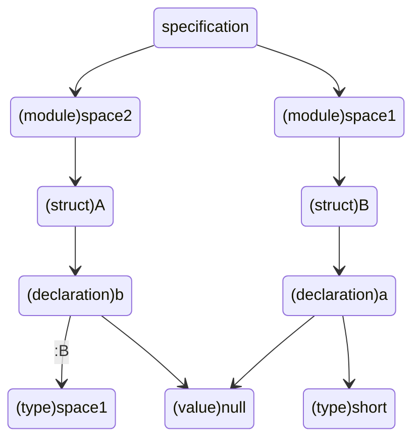

```mermaid
stateDiagram
specification --> (module)space2
(module)space2-->(struct)A
(struct)A-->(declaration)b
(declaration)b-->(type)space1::B
(declaration)b-->(value)null
specification --> (module)space1
(module)space1-->(struct)B
(struct)B-->(declaration)a
(declaration)a-->(type)short
(declaration)a-->(value)null

```