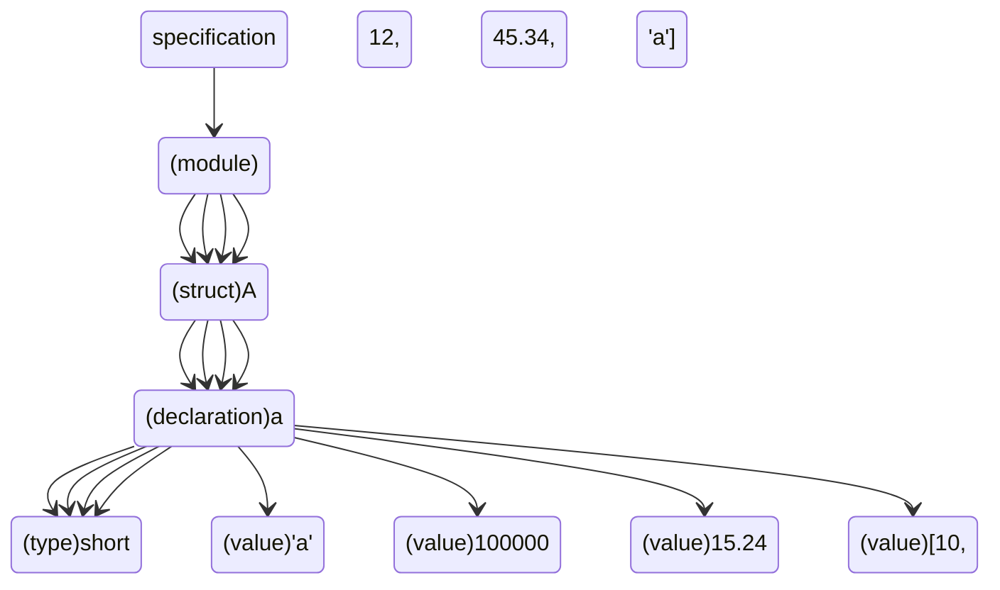

```mermaid
stateDiagram
specification --> (module)
(module)-->(struct)A
(struct)A-->(declaration)a
(declaration)a-->(type)short
(declaration)a-->(value)'a'
(module)-->(struct)A
(struct)A-->(declaration)a
(declaration)a-->(type)short
(declaration)a-->(value)100000
(module)-->(struct)A
(struct)A-->(declaration)a
(declaration)a-->(type)short
(declaration)a-->(value)15.24
(module)-->(struct)A
(struct)A-->(declaration)a
(declaration)a-->(type)short
(declaration)a-->(value)[10, 12, 45.34, 'a']

```