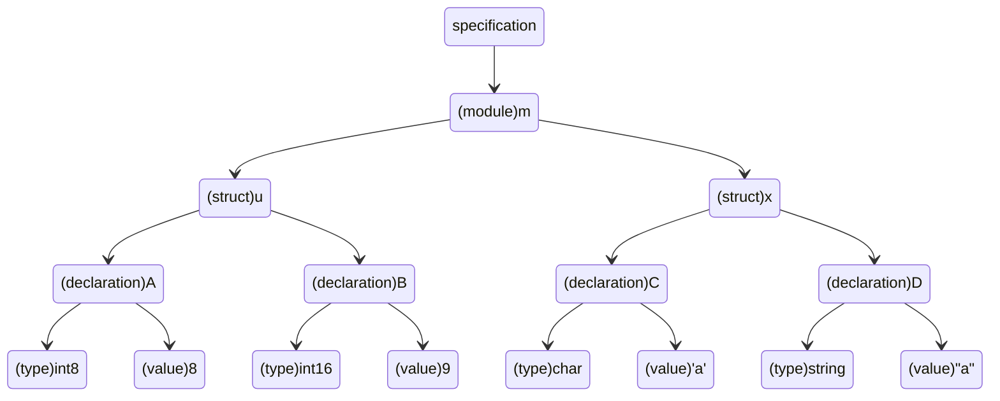

```mermaid
stateDiagram
specification --> (module)m
(module)m-->(struct)u
(struct)u-->(declaration)A
(declaration)A-->(type)int8
(declaration)A-->(value)8
(struct)u-->(declaration)B
(declaration)B-->(type)int16
(declaration)B-->(value)9
(module)m-->(struct)x
(struct)x-->(declaration)C
(declaration)C-->(type)char
(declaration)C-->(value)'a'
(struct)x-->(declaration)D
(declaration)D-->(type)string
(declaration)D-->(value)"a"

```